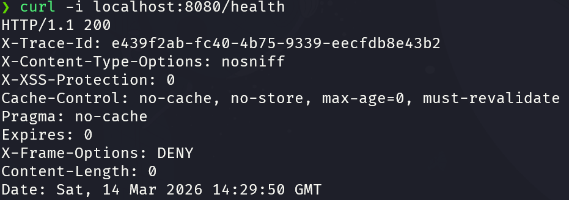
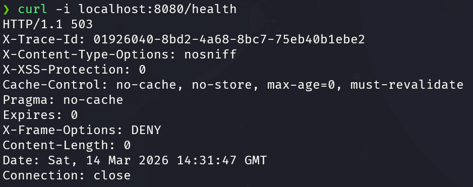

# Space Cats Market

Space Cats Market is a Spring Boot application for managing cosmic cat products.

## Налаштування (Environment Variables)

Для коректної роботи застосунку необхідно задати наступні змінні оточення:

- `DB_HOST` — хост бази даних (наприклад, `localhost`)
- `DB_PORT` — порт бази даних (наприклад, `5432`)
- `DB_NAME` — назва бази даних (наприклад, `galactic_cats`)
- `DB_USER` — користувач бази даних (наприклад, `postgres`)
- `DB_PASSWORD` — пароль користувача бази даних (наприклад, `root`)
- `GITHUB_CLIENT_ID` — Client ID для автентифікації через GitHub
- `GITHUB_CLIENT_SECRET` — Client Secret для автентифікації через GitHub

---

## Підтвердження Health Check

Застосунок надає ендпоінт `/health`, який перевіряє підключення до бази даних.

### Успішний результат (200 OK)
Коли база даних підключена та доступна:



### Помилка (503 Service Unavailable)
Коли база даних зупинена вручну (наприклад, вимкнено контейнер PostgreSQL):



---

## Приклад логів (JSON)

При завантаженні застосунок виводить логи у форматі JSON.

```json
{"timestamp":"2026-03-14T14:26:08.509Z","level":"INFO","message":"Tomcat started on port 8080 (http) with context path '/'"}
{"timestamp":"2026-03-14T14:26:08.532Z","level":"INFO","message":"Started SpaceCatsMarketApplication in 18.57 seconds (process running for 20.728)"}
```

---

## Підтвердження Graceful Shutdown
Нижче наведено приклад логів, які з'являються після отримання сигналу `SIGTERM`.

```json
{"timestamp":"2026-03-14T14:51:08.823Z","level":"INFO","message":"Commencing graceful shutdown. Waiting for active requests to complete"}
{"timestamp":"2026-03-14T14:51:08.829Z","level":"INFO","message":"Graceful shutdown complete"}
{"timestamp":"2026-03-14T14:51:08.838Z","level":"INFO","message":"Closing JPA EntityManagerFactory for persistence unit 'default'"}
{"timestamp":"2026-03-14T14:51:08.843Z","level":"INFO","message":"HikariPool-1 - Shutdown initiated..."}
{"timestamp":"2026-03-14T14:51:08.853Z","level":"INFO","message":"HikariPool-1 - Shutdown completed."}
```